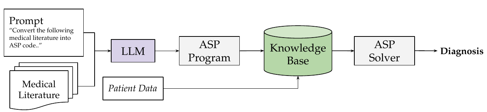

## A Proof-of-Concept for Explainable Disease Diagnosis Using Large Language Models and Answer Set Programming

Accurate disease prediction is vital for timely intervention, effective treatment, and reducing medical complications. While symbolic AI has been applied in healthcare, its adoption remains limited due to the effort required for constructing high-quality knowledge bases. 
This work introduces McCoy, a framework that combines Large Language Models (LLMs) with Answer Set Programming (ASP) to overcome this barrier. 
McCoy orchestrates an LLM to translate medical literature into ASP code, combines it with patient data, and processes it using an ASP solver to arrive at the final diagnosis. 
This integration yields a robust, interpretable prediction framework that leverages the strengths of both paradigms. Preliminary results show McCoy has strong performance on small-scale disease diagnosis tasks. 


McCoy overview. The diagnostic process begins by transforming
medical literature into an ASP program using a LLM. An ASP solver then executes
the program and produces a final diagnosis based on each patient’s data.

[📖 Paper](https://arxiv.org/abs/2512.23932)

## Citation

If you use this repository or build upon this work, please use this citation:

```bibtex
@misc{gemou2025proofofconceptexplainablediseasediagnosis,
  title        = {A Proof-of-Concept for Explainable Disease Diagnosis Using Large Language Models and Answer Set Programming},
  author       = {Gemou, Ioanna and Lamprou, Evangelos},
  year         = {2025},
  eprint       = {2512.23932},
  archivePrefix= {arXiv},
  primaryClass = {cs.AI},
  url          = {https://arxiv.org/abs/2512.23932}
}

